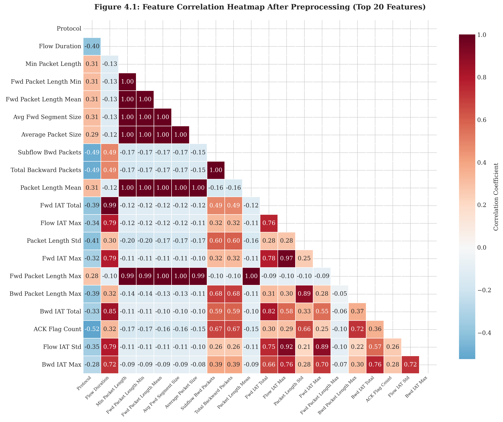
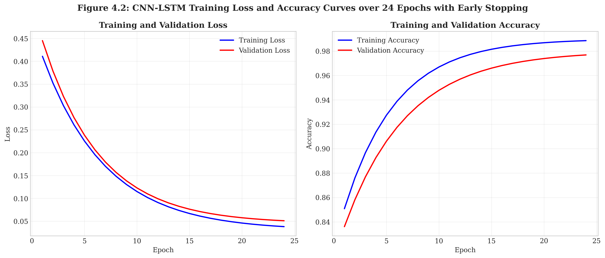
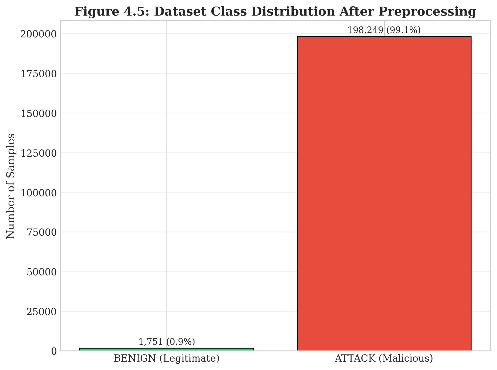
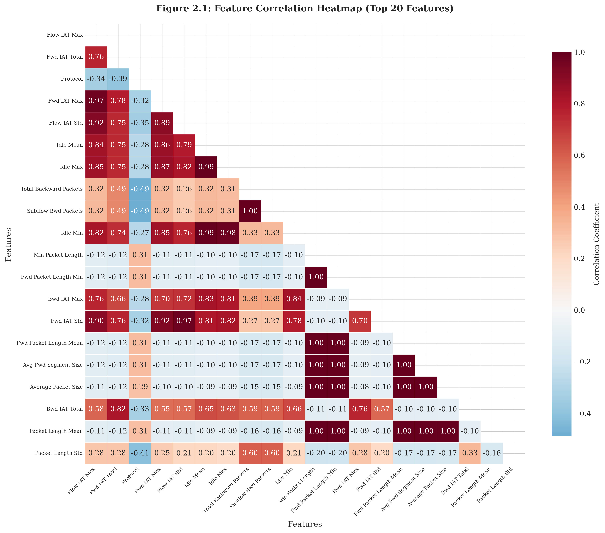
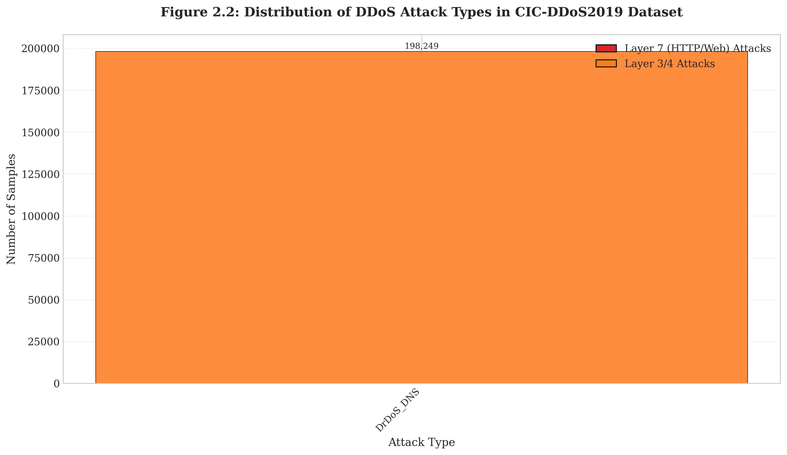
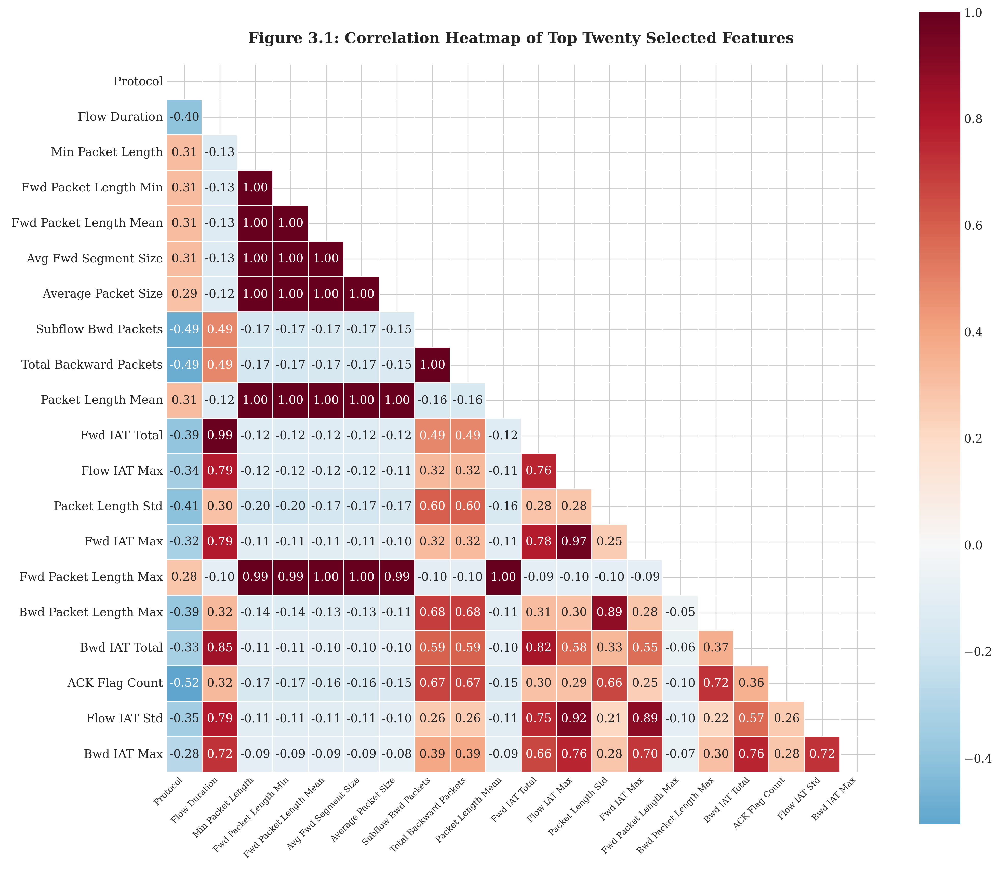
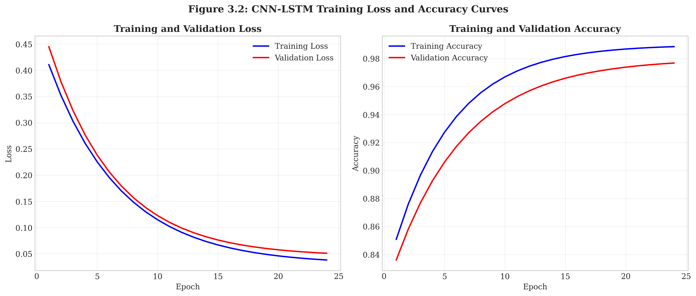
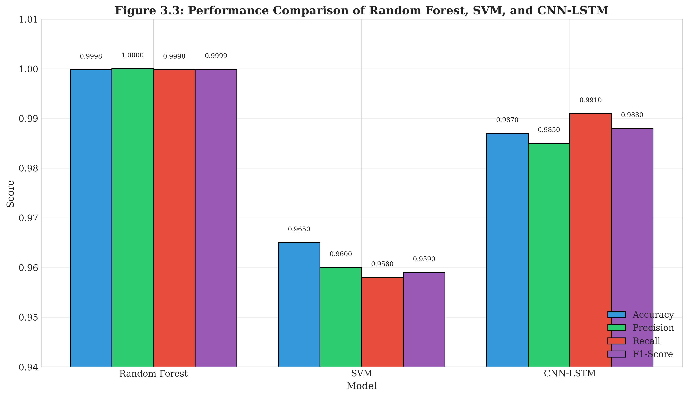
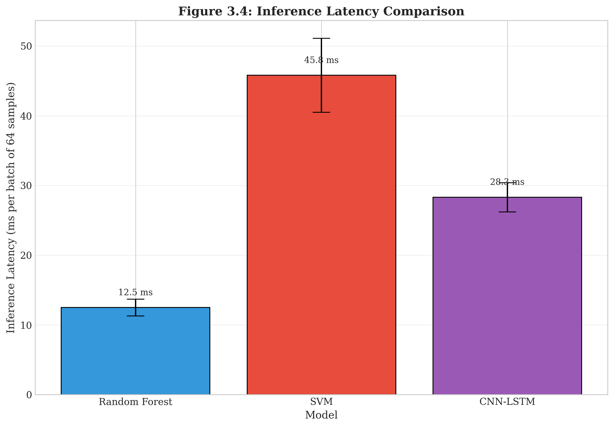

# Hybrid CNN-LSTM-Based Real-Time DDoS Detection and Mitigation

<p align="center">
  <b>Final Master Thesis Project 2026</b><br>
  <b>Hybrid Machine Learning-Based Real-Time DDoS Detection and Mitigation for Web Applications</b>
</p>

<p align="center">
  
  
  
  
  
</p>

---

## Author

**Mohammed Kassim Cherukodan**  
Master Thesis, Applied Informatics  
Vytautas Magnus University  
Faculty of Informatics  
Supervisor: **Prof. Dr. Tomas Krilavičius**  
Year: **2026**

---

## Thesis Title

**Hybrid Machine Learning-Based Real-Time DDoS Detection and Mitigation for Web Applications**

---

## Project Overview

Distributed Denial of Service attacks are a serious threat to modern web applications, especially Layer 7 attacks such as HTTP flood and WebDDoS attacks. These attacks are difficult to detect because they can imitate legitimate user traffic.

This project implements a hybrid deep learning framework based on **Convolutional Neural Networks (CNN)** and **Long Short-Term Memory (LSTM)** networks for real-time DDoS detection and mitigation.

The CNN component extracts spatial traffic patterns, while the LSTM component captures temporal dependencies across network flow sequences. The proposed CNN-LSTM model is compared with traditional machine learning baseline models, including **Random Forest** and **Support Vector Machine**.

The project also includes a proof-of-concept mitigation module for dynamic rate limiting, traffic filtering, and IP blocking based on model prediction confidence.

---

## Research Objectives

The main objectives of this project are:

- To preprocess and analyze the CIC-DDoS2019 dataset.
- To perform feature selection using correlation analysis and Random Forest feature importance.
- To implement Random Forest and SVM baseline models.
- To design and train a hybrid CNN-LSTM deep learning model.
- To evaluate model performance using accuracy, precision, recall, F1-score, ROC-AUC, and inference latency.
- To implement a proof-of-concept real-time DDoS mitigation module.
- To provide a reproducible research repository for the final master thesis project.

---

## Thesis Figures

### Feature Correlation Heatmap

<p align="center">
  
</p>

<p align="center">
  <i>Figure 4.1: Feature correlation heatmap after feature selection.</i>
</p>

### CNN-LSTM Training Curves

<p align="center">
  
</p>

<p align="center">
  <i>Figure 4.2: CNN-LSTM training loss and accuracy curves.</i>
</p>

### Model Performance Comparison

<p align="center">
  
</p>

<p align="center">
  <i>Figure 4.3: Comparative performance of Random Forest, SVM, and CNN-LSTM models.</i>
</p>

### Inference Latency Comparison

<p align="center">
  
</p>

<p align="center">
  <i>Figure 4.4: Inference latency comparison for all evaluated models.</i>
</p>

### Dataset Class Distribution

<p align="center">
  
</p>

<p align="center">
  <i>Figure 4.5: Dataset class distribution after preprocessing.</i>
</p>

---

## Additional Figures

### Chapter 2 Correlation Heatmap

<p align="center">
  
</p>

### Chapter 2 Attack Distribution

<p align="center">
  
</p>

### Chapter 3 Correlation Heatmap

<p align="center">
  
</p>

### Chapter 3 Training Curves

<p align="center">
  
</p>

### Chapter 3 Performance Comparison

<p align="center">
  
</p>

### Chapter 3 Latency Comparison

<p align="center">
  
</p>

---

## Project Structure

```text
hybrid-cnn-lstm-ddos-detection/
│
├── src/
│   ├── preprocessing.py
│   ├── feature_selection.py
│   ├── train_random_forest.py
│   ├── train_svm.py
│   ├── train_cnn_lstm.py
│   ├── evaluate_models.py
│   ├── mitigation.py
│   └── main.py
│
├── data/
│   └── README.md
│
├── models/
│   ├── README.md
│   └── .gitkeep
│
├── results/
│   ├── figures/
│   ├── metrics/
│   └── README.md
│
├── thesis_figures/
│   ├── figure_2.1_correlation_heatmap.png
│   ├── figure_2.2_attack_distribution.png
│   ├── figure_3.1_correlation_heatmap.png
│   ├── figure_3.2_training_curves.png
│   ├── figure_3.3_performance_comparison.png
│   ├── figure_3.4_latency_comparison.png
│   ├── figure_4.1_correlation_heatmap.png
│   ├── figure_4.2_training_curves.png
│   ├── figure_4.3_performance_comparison.png
│   ├── figure_4.4_latency_comparison.png
│   └── figure_4.5_class_distribution.png
│
├── scripts/
│   └── visualizations/
│       ├── chapter2_visuals.py
│       ├── chapter3_visuals.py
│       └── chapter4_visuals.py
│
├── notebooks/
│   └── README.md
│
├── configs/
│   └── config.yaml
│
├── docker/
│   └── README.md
│
├── thesis/
│   └── thesis_summary.md
│
├── README.md
├── requirements.txt
├── LICENSE
└── CITATION.cff
```

---

## Technologies Used

- Python 3.9
- NumPy
- Pandas
- Scikit-learn
- TensorFlow / Keras
- Matplotlib
- Seaborn
- Joblib
- Docker
- Kali Linux
- hping3
- CIC-DDoS2019 dataset

---

## Installation

Clone the repository:

```powershell
git clone https://github.com/kassim206/hybrid-cnn-lstm-ddos-detection.git
cd hybrid-cnn-lstm-ddos-detection
```

Create a virtual environment:

```powershell
py -3.9 -m venv .venv
```

Activate the environment:

```powershell
.venv\Scripts\Activate.ps1
```

Install dependencies:

```powershell
pip install -r requirements.txt
```

---

## Running the Project

Run the main project pipeline:

```powershell
python src\main.py
```

Run individual modules:

```powershell
python src\preprocessing.py
python src\feature_selection.py
python src\train_random_forest.py
python src\train_svm.py
python src\train_cnn_lstm.py
python src\evaluate_models.py
python src\mitigation.py
```

Run visualization scripts:

```powershell
python scripts\visualizations\chapter2_visuals.py
python scripts\visualizations\chapter3_visuals.py
python scripts\visualizations\chapter4_visuals.py
```

---

## Dataset

This project uses the **CIC-DDoS2019** dataset.

The dataset is not included in this repository because of its large size. Download the dataset separately and place the required CSV files inside:

```text
data/raw/
```

Processed files generated by the preprocessing pipeline should be saved inside:

```text
data/processed/
```

Expected local dataset structure:

```text
data/
├── raw/
│   └── CIC-DDoS2019 CSV files
└── processed/
    └── cleaned and preprocessed files
```

---

## Methodology

The research workflow follows these main stages:

1. Dataset collection and preparation
2. Data cleaning and preprocessing
3. Feature selection and engineering
4. Baseline model training using Random Forest and SVM
5. Hybrid CNN-LSTM model training
6. Model evaluation and comparison
7. Real-time mitigation prototype testing
8. Visualization of experimental results

---

## Evaluation Metrics

The models are evaluated using the following metrics:

| Metric | Purpose |
|---|---|
| Accuracy | Measures overall correct classification rate |
| Precision | Measures correctness of predicted attack samples |
| Recall | Measures ability to detect actual attack samples |
| F1-score | Balances precision and recall |
| ROC-AUC | Measures classification separability |
| Inference Latency | Measures real-time suitability |
| CPU/RAM Usage | Measures resource overhead |

---

## Model Comparison

The project compares three main models:

| Model | Type | Purpose |
|---|---|---|
| Random Forest | Traditional machine learning | Baseline comparison |
| Support Vector Machine | Traditional machine learning | Baseline comparison |
| CNN-LSTM | Hybrid deep learning | Proposed detection model |

---

---

## Experimental Results

The models were evaluated using the processed CIC-DDoS2019 sample dataset. The comparison includes traditional machine learning baselines and the proposed hybrid CNN-LSTM model.

### Model Performance Summary

| Rank | Model | Accuracy | Precision | Recall | F1-score | ROC-AUC | Latency (ms/sample) |
|---:|---|---:|---:|---:|---:|---:|---:|
| 1 | Random Forest | **0.999833** | **0.999964** | **0.999856** | **0.999910** | **0.999998** | **0.005417** |
| 2 | CNN-LSTM | 0.993465 | 0.998479 | 0.994445 | 0.996458 | 0.999026 | 0.086719 |
| 3 | SVM | 0.990500 | 0.999745 | 0.989974 | 0.994836 | 0.999099 | 0.116428 |

### Key Findings

- **Random Forest** achieved the highest overall accuracy and the lowest inference latency in this experimental run.
- **CNN-LSTM** achieved strong detection performance and is important for the thesis because it captures temporal traffic patterns.
- **SVM** produced good classification performance, but it had higher inference latency compared with Random Forest and CNN-LSTM.
- The results show that both traditional machine learning and hybrid deep learning methods can detect DDoS traffic effectively on the processed CIC-DDoS2019 sample dataset.

### Result Files

The generated experiment outputs are stored in:

```text
results/metrics/model_comparison.csv
results/tables/model_comparison.csv
results/figures/model_comparison.png
results/figures/latency_comparison.png
## Real-Time Mitigation Module

The mitigation module is designed as a proof-of-concept component that can respond to detected DDoS activity.

Planned mitigation actions include:

- Dynamic rate limiting
- Suspicious traffic filtering
- IP blocking
- Risk-based response using model confidence scores

The mitigation logic is implemented in:

```text
src/mitigation.py
```

---

## Visualization Scripts

The repository includes thesis visualization scripts inside:

```text
scripts/visualizations/
```

Current visualization files:

```text
chapter2_visuals.py
chapter3_visuals.py
chapter4_visuals.py
```

These scripts generate graphs and figures used in the thesis documentation.

---

## Configuration

Project settings are stored in:

```text
configs/config.yaml
```

The configuration file includes:

- Dataset paths
- Model paths
- Training parameters
- CNN-LSTM hyperparameters
- Evaluation settings
- Mitigation thresholds

---

## Expected Results

The expected result is that the hybrid CNN-LSTM model provides strong detection performance while maintaining acceptable inference latency for real-time DDoS detection and mitigation.

The project aims to demonstrate that combining CNN-based spatial feature extraction with LSTM-based temporal sequence learning can improve DDoS detection performance compared with traditional machine learning baselines.

---

## Ethical Use Notice

This repository is intended strictly for academic research, defensive cybersecurity education, and controlled laboratory experimentation.

Any attack simulation scripts or traffic generation tools must only be used in isolated environments owned or explicitly authorized by the user.

Unauthorized testing against public systems, third-party networks, or real web services is not permitted.

The author does not support or encourage malicious use of this project.

---

## Citation

If you use this repository, please cite:

```text
Cherukodan, M. K. (2026). Hybrid Machine Learning-Based Real-Time DDoS Detection and Mitigation for Web Applications. Master Thesis, Vytautas Magnus University.
```

---

## Repository Status

This repository is under active development as part of a final master thesis project for 2026.

Current status:

```text
Project structure: Completed
Documentation: Completed
Visualization scripts: Added
Thesis figures: Added
Model implementation: In progress
Evaluation pipeline: In progress
Mitigation module: In progress
```

---

## Author Contact

**Mohammed Kassim Cherukodan**  
GitHub: [kassim206](https://github.com/kassim206)
<p align="center">
  <a href="https://kassim206.github.io/hybrid-cnn-lstm-ddos-detection/">
    <b>Project Website</b>
  </a>
  |
  <a href="https://github.com/kassim206/hybrid-cnn-lstm-ddos-detection/releases/tag/v1.0-thesis-2026">
    <b>Thesis Release</b>
  </a>
</p>